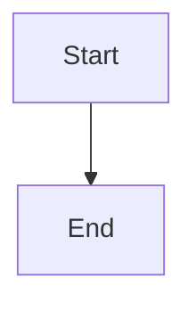

# Bug Report

### Describe the bug

Mermaid diagrams are not rendering anymore - the diagram content appears to be empty. When I add a mermaid code block to my markdown file, the component renders but shows nothing.

### Reproduction

Create a markdown file with a mermaid diagram:

````markdown

````

The diagram should render but instead shows up empty/blank on the page.

### Expected behavior

The mermaid diagram should render correctly with the content from the code block (the graph definition). The diagram visualization should be visible.

### System Info

- Docusaurus version: latest
- Browser: Chrome

---
Repository: /testbed
