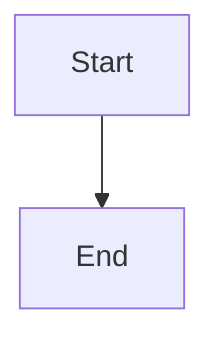

# Bug Report

### Describe the bug

When using Mermaid code blocks in MDX files, they're no longer being rendered as Mermaid diagrams. Instead, they appear as regular code blocks with syntax highlighting.

### Reproduction

Create an MDX file with a Mermaid code block:

````markdown

````

### Expected behavior

The code block should be transformed into a Mermaid diagram component and rendered as an interactive diagram. Instead, it's being rendered as a plain code block with the raw Mermaid syntax visible.

### Additional context

This seems to have broken recently - Mermaid diagrams were working fine before. Now all my documentation pages with flowcharts and diagrams are just showing the raw code instead of the actual visualizations.

---
Repository: /testbed
