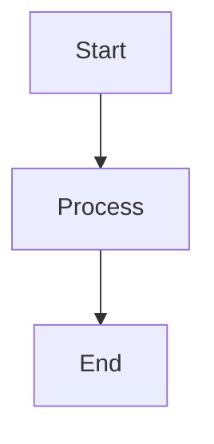

# Bug Report

### Describe the bug

Mermaid diagrams are no longer rendering in my documentation. I have code blocks with the `mermaid` language identifier, but they're now being displayed as plain code blocks instead of being rendered as diagrams.

### Reproduction

```markdown

```

The above code block is not being processed as a Mermaid diagram anymore. It just shows up as a regular code block with syntax highlighting instead of rendering the actual diagram.

### Expected behavior

The code block should be rendered as an interactive Mermaid diagram, not as plain code.

### System Info
- Docusaurus version: latest
- Browser: Chrome

This was working fine before, not sure what changed. Any help would be appreciated!

---
Repository: /testbed
