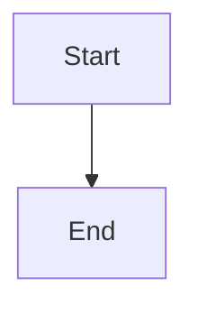

# Bug Report

### Describe the bug

Mermaid diagrams are not rendering in my documentation. I have code blocks with the `mermaid` language identifier, but they're just showing up as plain text instead of being rendered as diagrams.

### Reproduction

```markdown

```

The above code block should render as a Mermaid diagram, but it's just displayed as a regular code block with syntax highlighting.

### Expected behavior

The Mermaid code block should be transformed and rendered as an interactive diagram in the documentation page.

### System Info
- Docusaurus version: latest
- Browser: Firefox 121

This was working fine before, but after updating it stopped rendering. I've checked my configuration and the Mermaid plugin is enabled. Not sure what changed.

---
Repository: /testbed
