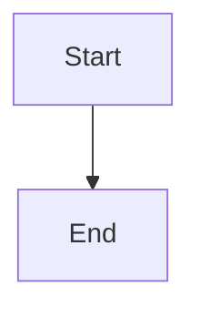

# Bug Report

### Describe the bug

Mermaid code blocks are not being rendered correctly in MDX files. When I add a mermaid diagram using the standard code fence syntax with the `mermaid` language identifier, it doesn't get transformed into the proper mermaid component.

### Reproduction

```markdown

```

The mermaid diagram doesn't render at all. It seems like the plugin is not detecting mermaid code blocks anymore.

### Expected behavior

The mermaid code block should be transformed and rendered as a diagram in the documentation page.

### Additional context

This was working fine before, but after a recent update the mermaid diagrams stopped showing up completely. Regular code blocks with other language identifiers still work as expected.

---
Repository: /testbed
